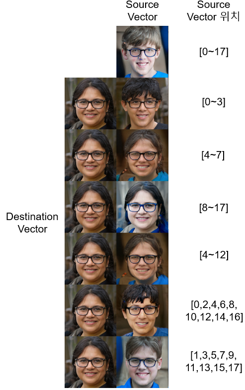
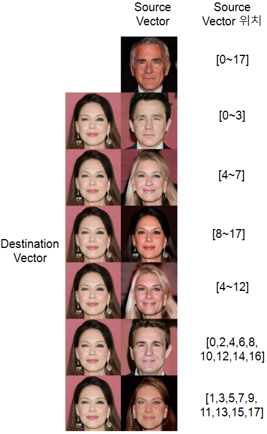
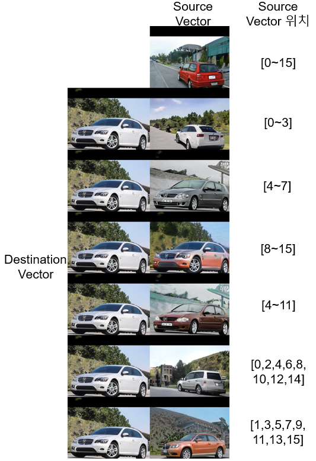

# 산업공학캡스톤IC-PBL 팀1 Report

산업공학과 이현희  
산업공학과 김은서  
산업공학과 이해준  
산업공학과 이승현  
산업공학과 박윤성  

# 내용

[산업공학캡스톤IC-PBL 팀1 Report](#산업공학캡스톤ic-pbl-팀1-report)

[1. 서론](#서론)

[2. 관련 연구](#관련-연구)

[2.1. PGGAN](#pggan)

[2.2. StyleGAN](#style-gan)

[2.2.1. Mapping Network: 8-layer MLP(Fully-Connected-layer)
4](#mapping-network-8-layer-mlpfully-connected-layer)

[2.2.2. Synthesis Network: AdaIN + Constant input + Stochastic variation
4](#synthesis-network-adain-constant-input-stochastic-variation)

[3. 연구 및 실험 결과와 분석](#연구-및-실험-결과와-분석)

[3.1. 실험 환경](#실험-환경)

[3.2. 실험 결과](#실험-결과)

[4. 결론](#결론)

# 연구 요약

Style vector를 기반으로 이미지를 생성하는 모델인 style-Based Generator
Architecture for Generative Adversarial Networks(이하 style-GAN) 구조를
이해하고 관련 논문에서 사용한 데이터셋(FFHQ) 외에 CelebA-HQ, 특징을 가진
인물들을 직접 분류한 데이터셋, 고양이, 자동차 등 다양한 데이터 셋에서
style-GAN의 성능을 파악하였다. 더불어, style mixing 과정에서 style
vector가 삽입되는 위치를 다양하게 변환하여 기존 style-GAN 논문에서
제안하는 방식과 본 연구에서 제안하는 방식 모두에 대해 주관적인 성능
평가를 진행하였다. 나아가서, style mixing 시에 각각 다른 데이터셋으로
학습된 mapping network를 거친 두 개의 latent vector w를 하나의 synthesis
network에서 합성해보는 시도를 통해서 다양한 style mixing에 대한 성능평가
또한 진행해보았다.

## 서론 

지난 몇 년간, 데이터 증강을 통한 데이터 부족 문제의 해결, 실제 얼굴에
다른 스타일을 전이하는 상업적인 기술에 대한 수요 증가, 심지어는 나아가
예술 분야의 활용에서까지 이미지 생성 기술이 적용되면서 이에 대한 연구가
활발하게 진행되고 있다. 특히, 기존 GAN이 정규분포 무작위 샘플링을
바탕으로 랜덤하게 이미지를 생성하는 데 그쳤다면, style-GAN은 style
vector 개념을 적용하여 두 개의 서로 다른 style을 합성할 수 있게 하는
의의를 가졌다.

이에 본 연구에서는 style-GAN의 style mixing을 중점적으로 다양한 방법을
적용해보고, 결과에 대한 원인을 분석한다. 첫 번째로 style-GAN의 데이터
셋을 바꿔보며 모델의 범용성을 확인한다. 기존 style-GAN 논문에서 사용된
FFHQ 데이터셋은 고해상도 이미지 7만장을 활용하여 긴 학습시간 동안 학습을
진행하였고, 이에 대한 학습이 잘 이루어져 이미지 합성에 있어 좋은 성능을
보이는 것은 잘 알려져 있다. 본 연구에서는 학습 시간과 GPU 메모리와 같은
제한적인 학습 환경에서 나타나는 성능에 대한 분석 또한 진행한다. 두
번째로 style mixing 과정에서 latent vector들의 순서를 조정함으로써
목적성에 맞는 결과를 얻을 수 있는 방법을 제안한다. 서로 다른 분포로부터
나와 mapping network를 거친 두 개의 latent vector w1과 w2를 합성
과정에서 다양한 순서로 배치하여 결과를 비교분석한 결과를 토대로 방법을
제안한다. 분석과정에서 모델이 낮은 해상도 이미지를 합성할 때 적용되는
style vector가 이미지 생성 결과에 큰 영향을 주고, 높은 해상도 이미지를
합성할 때 적용되는 style vector는 상대적으로 작은 영향을 주는 것 또한
확인할 수 있다. 마지막으로는 두 번째 연구에서 나아가 두 개의 서로 다른
데이터셋으로 학습된 mapping network를 거친 latent vector들을 하나의
synthesis network에서 합성하는 시도를 통해서, 데이터셋을 통해 학습된
mapping network가 자기 자신의 synthesis network가 아닌 다른 synthesis
network를 통해 합성될 때 어떤 결과를 보이는 지 확인했다.

## 2. 관련 연구

### 2.1. PGGAN 

기존 GAN에는 다음과 같은 문제점들이 있었다. 1) 고해상도 이미지일 수록
real과 fake 이미지를 구분하기 쉽기 때문에 generator보다 discriminator
학습이 쉬워진다. 2) 고해상도의 이미지를 만들기 위해서는 메모리리 제약
때문에 더 작은 mini-batch를 사용해야 하고, 학습 안정성이 떨어지게 된다.
3) Mode collapse: 생성자가 loss만을 줄이기 위해 학습을 하여 전체 데이터
분포를 찾지 못하게 되고, 결국 하나의 mode에만 강하게 몰려서 다양성을
잃어버리게 된다. 이러한 문제들을 해결하기 위해 PGGAN은 학습을 거치며 4×4
해상도부터 1024×1024의 해상도로 upscaling을 진행하며 학습하게 된다. 낮은
해상도에서는 큰 sclae의 feature들을 학습하며, 점차 해상도가 높아질수록
세부적인 feature들을 학습하게 된다. 점진적으로 layer를 추가하면서
학습하기 때문에 안정적으로 고화질의 이미지를 만들 수 있다.

**\<그림 1: PG-GAN의 구조\>**

### 2.2. Style-GAN

**\<그림 2: Style-GAN의 Generator 구조\>**

Style-GAN은 style-based generator를 사용한 GAN 구조로 generator를 제외한
부분은 PGGAN의 구조를 따른다. style-GAN의 Generator의 특징은 크게 두
개의 network로 이루어 진 것인데, 첫 번째 네트워크는 mapping network, 두
번째 네트워크는 synthesis Network이다. 각각은 다음과 같다.

### 2.2.1. Mapping Network: 8-layer MLP(Fully-Connected-layer)

**\<그림3: Distribution\>**

기존 PGGAN과 같은 latent variable 기반의 생성 모델은, 가우시안 분포
형태의 랜덤 noise를 입력으로 넣어주게 된다. 이 때 latent space Z는
n차원의 가우시안 분포로 구성되어 있어 그림3의 (b)와 같은 형태를 띄게
된다. 이 때, 기존 학습 데이터셋의 특징 분포가 (a)의 왼쪽 위와 같이 텅
비어 있는 부분이 있다면, 이를 mapping하는 과정에서 wrapping이 발생하게
된다. wrapping이 발생하면 인접한 분포에서 생성된 이미지의 특징이 갑자기
급변하게 되는 문제가 생긴다. 또한, 서로 연관이 없는 특징들이 매우 가까이
붙어 있어 특징이 엉키게 되는 entanglement 문제가 생기기도 한다. 이러한
문제를 해결하기 위해 8-layer MLP를 통해 Z space를 W space로 비선형적으로
mapping하여 문제점을 해결하고자 하는 네트워크가 mapping network이다.

### 2.2.2. Synthesis Network: AdaIN + Constant input + Stochastic variation

Mapping network를 거쳐 만들어진 latent vector w는 affine
transformation을 거쳐 style vector A로 변환된다. 이렇게 변환된 스타일
벡터는 4×4 해상도에서부터 1024×1024까지 9번의 학습 단계마다 2번의 AdaIN
과정에 들어가기 때문에, 1024×1024 해상도의 이미지를 생성하는 네트워크를
기준으로 이 벡터가 복제되어 18번에 걸쳐 들어가게 된다. 추후에 style
mixing 부분에서 설명하겠지만, styleGAN이 여러가지 스타일을 합성할 수
있는 원리는 이렇게 style vector가 18번 연산이 되는 과정에서, mapping
network를 거쳐 생성된 어떤 style vector를 활용하느냐에 따라 생성할 때
특징이 반영되기 때문이다.

**\<그림4: AdaIN에 관한 그림\>**

**\<그림5: Constant Input에 대한 그림\>**

다음은 synthesis network 구조 중, AdaIN과 synthesis network의 constant
input에 대한 설명이다. AdaIN은 adaptive instance normalization의
줄임말로 neural network에서 각 layer를 지나며 scale, variance의 변화가
생겨 학습이 불안정해지는 것을 방지하기 위해 사용하는 normalization 기법
중 하나이다. AdaIN의 수식은 그림 4의 수식과 같다. 일반적인 정규화 방법에
더하여 scaling과 bias를 적용하였다. synthesis network에서 style vector
A를 입력으로 받기 때문에 z에서 convolution 연산을 시작하는 것이 아닌
사전학습된 4x4x512 constant tensor에서 시작한다. 이는 random한 noise에서
출발하는 것보다 더 좋은 성능을 낸다.

생성된 고해상도의 이미지의 세부적인 특징들을 추가하기 위해 noise를
추가해주고, 이를 stochastic variation이라고 한다. Gaussian 분포에서
sampling한 noise를 convolution의 output(feature map)에 더해준다. B
block을 통해 featuremap 사이즈에 맞게 변형된다. 이러한 noise를 통해
머리카락의 배치, 모공, 주름 등의 세부적 특성들을 추가할 수 있다.

**\<그림6: Stochastic Variation에 관한 내용\>**

## 3. 연구 및 실험 결과와 분석

### 3.1. 실험 환경

본 연구는 Intel i7-6800k CPU, 64GB RAM, GTX 1080 8GB×1 GPU에서 환경에서
실험을 진행하였다. 논문에서 12GB 이상의 GPU 메모리를 가진 multiple GPU를
추천하는 만큼, 학습에 있어서 하드웨어 환경이 제한적이었다. Python 3.6.0,
Tensorflow 1.11.0, CUDA 9.0, Cudnn 7.3.1의 환경 아래 작업됐다.

### 3.2. 실험 결과

#### 3.2.1. 다양한 데이터셋에 대한 style-GAN의 범용성 확인

본 실험에서는 논문의 결과와 같은 FFHQ 데이터셋에 대해서는 생성된
이미지를 4장, 나머지 데이터셋들에 대해서는 완전 무작위로 8장의 결과를
뽑아 살펴보았다.

1)  FFHQ

**\<그림7: FFHQ 데이터셋으로 학습이 완료된 모델에 대한 이미지 생성
결과물\>**

기존 논문에서도 확인할 수 있듯이, FFHQ 데이터셋으로 잘 학습된 네트워크는
실제 사람 같은 이미지를 잘 생성함을 확인할 수 있었다.

2)  CelebA-HQ

CelebA-HQ는 1024×1024 해상도의 유명인사로 이루어진 30,000장의
데이터셋이다. CelebA-HQ로 학습이 끝까지 완료된 네트워크로 생성한
이미지의 결과는 아래와
같았다.

**\<그림8: CelebA-HQ 데이터셋으로 학습이 완료된 모델에 대한 이미지 생성
결과물\>**

일부 어색한 사진이 섞여 있었지만, 전체적으로 유명인사들의 화장법이나
머리스타일과 같은 특징들을 잘 반영하여 이미지가 생성이 된 모습을 확인할
수 있었다. 이미지 데이터의 개수가 30,000개로 FFHQ 데이터셋보다 작기
때문에 같은 해상도일지라도 세세한 디테일들을 나타내는 데는 상대적으로
낮은 성능을 보였다.

3)  LSUN Cat

256×256 해상도의 고양이 1,657,266 장으로 이루어진 LSUN cat dataset을
통해 학습을 완료한 네트워크를 통해 생성된 이미지의 결과물을 아래와
같았다.

**\<그림9: LSUN Cat 데이터셋으로 학습이 완료된 모델에 대한 이미지 생성
결과물\>**

데이터의 개수가 굉장히 많음에도 불구하고, 학습이 사람의 얼굴에 비해 잘
되지 않은 것을 확인할 수 있었다. 대부분의 생성된 사진들이 고양이의
형체가 어색하거나, 몸의 일부분이 제대로 형성이 되지 않았거나, 개수가
실제보다 더 많거나 심지어는 고양이의 형체가 아예 있지도 않은 결과를
보였다. 이를 통해서, 학습 시에 특징을 잘 학습할 수 있도록 같은 구도로
사람의 얼굴이 꽉 차게 고해상도로 존재했던 데이터셋이 아니라, 배경이 많이
포함되고 고양이가 이미지 내에 무작위한 크기로 무작위한 위치에 존재하는
경우에는 고양이의 특징을 제대로 잡아내지 못하고, 학습이 제대로
이루어지지 않는다는 것을 알 수 있었다. 이는 style-GAN 이미지 생성 모델의
한계로 생각할 수 있다.

4)  LSUN Car

마찬가지로 LSUN 데이터셋 중, 자동차 이미지를 제공하는 데이터셋이다.
512×384 해상도의 자동차 이미지 5,520,756 장으로 이루어져 있다. 이
데이터셋에 대해서 학습을 완전히 완료한 네트워크의 이미지 생성 결과는
아래와 같았다.

**\<그림10: LSUN Car 데이터셋으로 학습이 완료된 모델에 대한 이미지 생성
결과물\>**

LSUN Cat 데이터셋과 마찬가지로, 굉장히 많은 수의 데이터를 가지고 있다.
또한, 자동차 사진들은 대부분 한정된 구도에서 자동차의 특징이 잘 드러나는
사진들이기 때문에, 학습이 잘 이루어진 것을 확인할 수 있다. 이는 LSUN Cat
데이터셋과 대비되는데, 학습에 사용되는 사진 데이터셋이 공통적인 특징을
잘 나타낼 수 있는지 여부에 따라 학습 결과에 큰 차이가 나타남을 확인해 볼
수 있다.

5)  FFHQ(제한된 환경-학습 길이, GPU 메모리)

논문에서 사용한 데이터셋과 같은, 70,000장의 1024×1024 고해상도의 사람
얼굴 이미지 데이터셋은 FFHQ로 실험 환경에서 약 1주일 간 학습을 진행한
결과는 다음과 같았다.

**\<그림11: FFHQ 데이터셋으로 kimg=10526까지 학습된 모델에 대한 이미지
생성 결과물\>**

논문과 동일한 데이터셋을 활용하여 현재 실험 환경에서 학습의 길이를
나타내는 kimg(default:25000)가 10526가 될 때 까지 학습을 진행하였는데
이는 약 40%정도 학습이 완료되었다고 할 수 있다. 결과적으로 256×256
해상도의 이미지를 생성할 수 있는 네트워크까지 학습이 되었고, 아직
눈동자의 처리가 어색하거나, 일그러지는 등의 어색한 사진이 부분도 있지만,
이 정도 학습이 되어도 실제 사람처럼 보이는 이미지를 생성하는 경우가
많았다. kimg가 5306으로 더 학습 시간이 짧았을 때의 결과는 아래와 같았다.

**\<그림12: FFHQ 데이터셋으로 kimg=5306까지 학습된 모델에 대한 이미지
생성 결과물\>**

결과물을 살펴보면, 역시 256×256 해상도의 이미지이지만, 아직 학습이 많이
진행되지 않아 위의 결과보다 일그러지거나 자연스럽지 못한 부분이 많음을
확인할 수 있다.

6)  FFHQ 흑인 레이블링 데이터셋(제한된 환경-학습 길이, GPU 메모리)

본 데이터셋은 FFHQ 데이터셋에서 흑인들만을 직접 레이블링하여 얻은
1300장의 이미지로 이루어진 데이터셋이다. 이 데이터셋으로, 학습 길이,
데이터의 개수, GPU 메모리 등이 제한된 환경에서는 어떤 결과를 보이는지
확인하기 위하여 본 실험 환경에서 kimg가 5726까지 학습된 결과를
확인하였다. 이는 약 20% 정도 학습이 되었다고 볼 수 있고, 그 결과는
아래와 같았다.

**\<그림12: 흑인 데이터셋으로 kimg=5726까지 학습된 모델에 대한 이미지
생성 결과물\>**

본 모델은 해상도가 512×512에서 학습되고 있는 시점에 중단된 결과이다.
비슷한 환경에서 실험을 진행한 실험 7)을 살펴보자.

7)  FFHQ 아이 레이블링 데이터셋(제한된 환경-학습 길이, GPU 메모리)

위의 흑인 데이터셋과 마찬가지로, FFHQ에서 레이블링을 통해 3,155장의 아이
사진을 데이터셋으로 구성하였고, 본 연구 환경에서 kimg=4705까지 학습을
진행했다. 결과는 아래와 같았다.

**\<그림12: 아이 데이터셋으로 kimg=4705까지 학습된 모델에 대한 이미지
생성 결과물\>**

실험6)보다 이미지 데이터가 약 2배 이상 많았지만, 전체적인 결과 수준은
비슷했다. 실험6)과 실험7)의 결과를 256×256 해상도를 가지는 5) 실험과
비교해보자면, 512×512 해상도임에도 불구하고, 실험 5)의 결과보다 훨씬
해상도가 좋지 않아 보인다. 즉, style-GAN이 4×4에서 1024×1024 해상도까지
단계적으로 학습되는 과정에서 데이터셋의 개수가 적으면 해상도와 무관하게
결과가 많이 일그러지고 이미지에서 경계가 불분명해 좋지 않은 결과를
보임을 확인할 수 있었다.

#### 3.2.2. 하나의 모델로부터 Style Mixing 시에 Latent Vector의 조합에 따른 결과

기존 style GAN 논문에서는 앞서 설명한 style vector가 들어가는 위치를 4×4
해상도에서부터 1024×1024 해상도 순서로 0, 1, 2, ..., 16, 17이라고 할 때,
0~3에 들어가는 4개 style vector를 coarse style, 4~7의 4개를
middle style, 8~17의 10개를 fine style이라고 설명하며, 3가지의
조합을 제안하고 있다. 본 연구에서는 이러한 조합에 따른 각각의 결과와,
기존 논문에서 제안한 조합 이외에도 다양한 조합과 이에 따른 결과를
분석했다 또한, FFHQ 데이터셋 이외에 다른 데이터셋에서는 어떠한 방식으로
스타일 결합이 이루어지는지 확인했다.

하나의 모델로 style mixing의 합성 과정이 일어나기 전에 두 개의 latent
vector w에 대해서 각각 하나의 데이터셋으로 학습된 동일한 mapping
network와 affine 변환을 거쳐 style vector A로 만든다. 이 때 벡터 중
기본적인 골격을 이룰 벡터를 destination vector, 스타일을 추가하여 입힐
벡터를 source vector라고 한다. 스타일 벡터를 각 synthesis 네트워크에
순서대로 넣어주기 위해서 destination vector를 1024×1024 해상도를
기준으로 18개의 행으로 복제하여 행렬으로 만든다. 그 뒤에, source vector
행을 설정한 위치들에 기존 destination vector를 대체하여 넣어 준 뒤
synthesis network를 이 순서대로 vector들을 넣어주며 연산한다. 즉, source
vector를 하나도 넣지 않으면, destination vector를 기반으로 이미지가
합성되는 것과 같고 0부터 17까지 source vector로 모두 대체하여 넣어주면
source vector를 기반으로 이미지가 합성되는 것과 같은 것이다. 각
데이터셋에 대한 결과와 분석은 다음과 같다.

1)  FFHQ

논문에서 사용된 FFHQ 데이터셋이 완전히 잘 학습된 네트워크에 대해서,
스타일 벡터를 다양한 순서로 넣었을 때의 결과는 아래와 같다.

  

**\<그림 13: FFHQ Dataset에 대한 Style Mixing 결과물 1\>**

  

**\<그림 14: FFHQ Dataset에 대한 Style Mixing 결과물 2\>**

논문에서 언급한대로, 0부터 3까지인 coarse style에 source vector를
넣어주는 경우, 4부터 7까지인 middle style에 source vector를 넣어주는
경우, 그리고 8부터 17까지인 fine style에 source vector를 넣어주는 경우를
살펴보았다. 이에 더해 본 논문에서 제안하는 세 가지 경우를 더 추가하였다.
첫 번째는 18개의 벡터 중 중간에 해당하는 4\~12까지에 source vector를
넣어주는 경우, 두 번째는 짝수 부분에 source vector를 넣어주는 경우,
마지막으로는 홀수 부분에 source vector를 넣어주는 경우이다. 왼쪽과
오른쪽 사진은 서로 destination vector와 source vector를 바꿔준 경우이다.

전체적으로 살펴보았을 때, vector의 위치에 따라 모든 경우에 성립하는
규칙성이 있다고 보기는 어렵다. 하지만, 대체적으로 경향성은 보였다. 예를
들어, 0부터 3까지의 위치에 source vector가 들어갈 경우 전체적인 얼굴형,
구도, 표정 등을 결정했다. 8부터 18까지의 위치에 들어가는 sine style은
작은 특징들에만 영향을 준다. 이 때 특히 피부색과 배경이 결정되는 것이
두드러진다. 이외에도 본 논문에서 제안하는 4\~12까지의 9개를 source
vector로 바꿀 경우 source vector와 destination vector가 적절히 섞였다기
보다는, 대체로 destination vector들을 기반으로 하되 일부 특징들만 source
vector로 쏠린 것과 같은 결과를 낸다. 예를 들어, \<그림 12\>의 왼쪽과
\<그림 13\>의 오른쪽 결과를 살펴보면, source vector의 위치가 4\~12일 때,
얼굴 생김새는 0,1,2 위치에 들어간 destination vector와 많이 유사하다.
하지만, 피부색, 머리 질감, 머리 모양 등은 source vector의 것을 가진
모습을 볼 수 있다.

가장 유의미했던 것은 바로 벡터를 번갈아서 넣는 두 가지 경우였다. 기존
논문에서 제안한 결과들과는 다르게, 두 경우에서 모두 모든 특징이 적절히
섞인 결과물이 나타남을 확인할 수 있었다. 즉, 얼굴은 source vector,
피부색은 destination vector 등과 같이 특징이 한 쪽으로 치우쳐져서
결정되는 것이 아닌, 모든 특징들이 적절히 섞여 중간 정도의 모습을
나타냈다. 이처럼 두 스타일을 중간 지점으로 합치고 싶을 때, 본 연구에서
제안하는 방법을 사용하면 적절할 것으로 판단된다.

2)  CelebA-HQ

CelebA-HQ 데이터셋에 대한 결과는 다음과 같다.

  
  

**\<그림 15: CelebA-HQ Dataset에 대한 Stlye Mixing 결과물 1\>**

  
  

**\<그림 16: CelebA-HQ Dataset에 대한 Stlye Mixing 결과물 2\>**

CelebA-HQ 데이터셋도 마찬가지로 기존 논문에서 제안한 방식은 특징들이 한
쪽으로 치우쳐져 있는 반면에, 본 논문에서 제안하는 방식은 각 특징들이
중간 수준에서 적절히 이루어짐을 확인할 수 있었다.

기본적으로 많은 양의 고화질 데이터셋으로 잘 학습된 FFHQ와 CelebA-HQ 모두
사실과 같은 이미지를 잘 생성해내고, style-mixing 과정을 거친 결과 또한
여전히 사실과 같이 잘 생성하고 있음을 확인할 수 있었다. 이후에는,
고양이나 자동차와 같은 다른 데이터셋에서도 이러한 결과가 잘 나타나는지
확인해보았다.

3)  LSUN Cat

고양이 데이터셋과 같은 경우에는, 기본적으로 이미지를 생성할 때, 고양이의
형체를 가지는 사실적인 고양이를 생성해내는 경우가 거의 없기 때문에
특징이 어떠한 방식으로 합성이 되는지 분석하는 것이 무의미했다. 그럼에도
결과를 일부 첨부하였다.

  
  

**\<그림 17: LSUN Cat Dataset에 대한 Style Mixing 결과물 1\>**

  
  

**\<그림 18: LSUN Cat Dataset에 대한 Style Mixing 결과물 2\>**

고양이 같은 경우에는 256×256 해상도까지 학습이 되었기 때문에, synthesis
network가 총 7단계로 구성되어, 스타일 벡터가 18번이 아닌 14번만 들어가게
된다. 그렇기 때문에 들어가는 벡터 위치를 위와 같이 조정해주었다. 결과를
살펴보면 전체적으로 고양이 같지 않은 결과를 보이는 경우가 많았다. 그렇기
때문에 특징도 구별하기 어려웠지만, 전체적인 이미지의 구도나 고양이의
자세와 같은 것들은 초반의 style vector들에 의해 결정되고, 고양이의 색,
무늬와 같은 특징들은 후반부의 style vector들에 의해 결정되는 경향이
있었다.

4)  LSUN Car

자동차 데이터셋에 대해서는 앞서도 살펴봤듯이 유의미한 결과를 생성해냈다.
그리고 style mixing 또한 유의미하게 이루어지고 있다는 것을 확인했다. 즉,
네트워크가 잘 학습될 경우에는 style mixing에서도 이미지 생성과
마찬가지로 비례하여 좋은 성능을 나타낸다. 자동차 데이터셋 또한 512x384
해상도의 이미지를 생성하는 네트워크이기 때문에 스타일 벡터가 18번이
아니라 16번 들어가게 된다. 이에 따라 style vector가 들어가는 조합을
조정하였다. 결과는 아래와 같았다.

  
  

**\<그림 19: LSUN Car Dataset에 대한 Style Mixing 결과물 1\>**

자동차 데이터셋에 대해서도 FFHQ와 CelebA-HQ 데이터셋처럼, 본 연구에서
제안한 방식으로 했을 때 하나의 자동차 특징으로 치우치기 보다는 중간
정도의 결과를 보여 유의미함을 확인할 수 있었다.

제한된 환경의 데이터 결과에 대해서는 vector의 위치에 따른 특징들이 앞서
보았던 것과 비슷한 결과를 보였으나, 학습이 완료되지 않아 네트워크의
성능이 떨어지기 때문에 style-mixing의 성능 또한 떨어졌다. 따라서 특징의
분석이 무의미하다고 판단되어 간단히 결과만 첨부하였다.

5)  FFHQ(제한된 환경-학습 길이, GPU 메모리)

  
  

**\<그림 20: FFHQ Dataset으로 제한된 학습환경에서 학습된 네트워크에 대한
Style Mixing 결과물\>**

6)  FFHQ 흑인 레이블링 데이터셋(제한된 환경-학습 길이, GPU 메모리)

  
  

**\<그림 21: FFHQ 흑인 Dataset으로 제한된 학습환경에서 학습된 네트워크에
대한 Style Mixing 결과물\>**

7)  FFHQ 아이 레이블링 데이터셋(제한된 환경-학습 길이, GPU 메모리)

  
  

**\<그림 22: FFHQ 아이 Dataset으로 제한된 학습환경에서 학습된 네트워크에
대한 Style Mixing 결과물\>**

#### 3.2.3. 서로 다른 데이터셋으로 학습된 mapping network를 거친 latent vector들을 destination vector가 거친 네트워크의 synthesis network에서 합성

일반적으로 시드에 맞게 정규분포로 샘플링된 둘 이상의 latent vector z들을
하나의 데이터셋으로부터 학습된 mapping network와 synthesis network를
지나 합성이 이루어진다. 하지만 본 실험에서는, 두 개의 서로 다른
데이터셋으로부터 학습된 mapping network를 거쳐 destination vector의
네트워크를 기준으로 하나의 synthesis network에서 이미지를 합성해보는
시도를 해보았다. 이 실험을 통해 latent vector가 synthesis network가
학습된 데이터셋과 다른 데이터셋으로 학습된 mapping network를 지났을 때의
성능을 분석해보고, mapping network가 갖는 의의에 대해 연구했다. mapping
network가 갖는 의의를 온전히 파악하기 위해서 본 연구에서는 제한된 학습
환경에서 학습된 모델이 아닌, 안정적으로 완전히 학습이 완료된 네트워크만
활용하여 실험을 진행하였다.

FFHQ + CelebA-HQ

이 연구는 FFHQ 데이터셋으로 학습된 mapping network를 지난 latent
vector를 destination vector, CelebA-HQ 데이터셋으로 학습된 mapping
network를 지난 style vector를 source vector로 선정했다. 그리고 두 style
vector들은 FFHQ 데이터셋으로 학습된 네트워크의 synthesis network에서
진행하였다. 이에 대한 결과를 하나씩 살펴보자.

  
  

**\<그림 23: CelebA-HQ Dataset의 Mapping Network를 지난 Style Vector를
FFHQ Dataset로 학습된 네트워크에 추가하여 Style Mixing을 진행한
결과물\>**

이 결과는 \<그림14\>에서 학습을 진행한 시드와 같은 시드로 본 실험을
진행했을 때의 결과이다. 우선, source vector는 시드로부터 나온 latent
vector z를 CelebA-HQ 데이터셋으로 학습된 mapping network를 지나 latent
vector w로 만들었다. 각 그림에서 0~17 & source networks' mapping
network에 해당하는 사진은 이를 synthesis Network 또한 CelebA-HQ로 학습된
네트워크를 지나게 했을 때의 결과이다. latent vector z를 모두 CelebA-HQ의
데이터셋으로 학습된 네트워크를 지나게 했을 때는 금발의 여성이 결과물로
나오는 것을 알 수 있다. 하지만, 똑같은 latent vector w를 source
vector로서 FFHQ 데이터셋으로 학습된 synthesis network를 지나게 하면 전혀
다른 남성(Source vector의 위치:0~17)이 나오는 것을 확인할 수 있다.
이 때 살펴볼 점은, 이 결과 또한 실제 사람과 같은 모습을 잘 띄고 있어
다른 데이터셋을 통해 학습된 다른 mapping network를 거친 뒤에 synthesis
network에 활용될지라도 entanglement 문제를 해결하는 데 효과가 있었다는
것을 확인할 수 있다.

이외에 서로 다른 mapping network를 지난다고 해도 앞선 연구에서 살펴본 것
처럼 source vector의 위치에 따른 결과는 비슷한 양상을 보였다. 본
연구에서 제안하는 vector의 조합이 두 스타일의 중간 지점의 특징들을 잘
반영한 것을 볼 수 있다. 물론 본 연구에서 source vector가 합성되는
스타일은 destination vector의 synthesis network를 지난 결과물일
것이다(이 예시에서는 source vector가 0~17 위치에 들어가 결과물로
나온, CelebA-HQ의 mapping network를 거친 뒤 FFHQ의 synthesis를 거쳐
생성된 남성(왼쪽)과 어린 아이(오른쪽) 이미지).

1)  CelebA-HQ + FFHQ

비슷한 결과가 나타나는지, 같은 데이터셋 조합에 대해서 destination
vector와 source vector를 바꾸어 실험을 진행해보았다. 결과는 아래와
같았다.

  
  

**\<그림 24: FFHQ Dataset의 Mapping Network를 지난 Style Vector를
CelebA-HQ Dataset로 학습된 네트워크에 추가하여 Style Mixing을 진행한
결과물1\>**

  
  

**\<그림 25: FFHQ Dataset의 Mapping Network를 지난 Style Vector를
CelebA-HQ Dataset로 학습된 네트워크에 추가하여 Style Mixing을 진행한
결과물2\>**

결과는 마찬가지로, 다른 mapping network를 거치더라도 wrapping이나
entanglement 문제가 발생하여 어색한 결과물을 보이지 않고, 전체적으로
특징이 잘 구분되어 이미지가 실제있는 것과 같은 좋은 성능을 보였다.

2)  FFHQ + LSUN Cat

FFHQ 데이터셋과 CelebA-HQ는 서로 전혀 다른 데이터셋이지만, 전체적인 사진
구도나 특징이 비슷하기 때문에 서로 다른 mapping network를 사용하더라도
성능이 저하되지 않는 모습을 보일 수 있다고 생각했다. 이에 고양이
데이터셋으로 학습된 mapping network를 지난 style vector를 source
vector로서 FFHQ 데이터셋를 통해 학습된 synthesis network를 통해 합성을
진행해보았다. 이 때, 고양이 데이터셋으로 생성하는 이미지는 해상도가
256×256으로 style vector가 14개면 생성할 수 있지만, 합성되는 네트워크는
이미지 해상도가 1024×1024로 style vector가 18개 필요하기 때문에 고양이
이미지를 생성한 뒤에, source vector 행렬의 행 수를 14개에서 18개로
늘려주는 과정을 통해서 합성을 진행했다. 결과는 흥미로웠다.

  
  

**\<그림 26: LSUN Cat Dataset의 Mapping Network를 지난 Style Vector를
FFHQ Dataset로 학습된 네트워크에 추가하여 Style Mixing을 진행한
결과물1\>**

  
  

**\<그림 27: LSUN Cat Dataset의 Mapping Network를 지난 Style Vector를
FFHQ Dataset로 학습된 네트워크에 추가하여 Style Mixing을 진행한
결과물2\>**

FFHQ 데이터셋과 CelebA-HQ 데이터셋에서는 서로 다른 mapping network를
사용해도 성능이 거의 떨어지지 않았던 것과는 달리, 고양이 데이터셋을 통해
학습된 mapping network를 통해 연산된 style vector를 활용하여 FFHQ
synthesis network에서 합성 시에는 성능이 눈에 띄게 떨어졌다. 눈동자가
부자연스럽거나, 얼굴형의 윤곽이 제대로 두드러지지 않는다든가 하는 성능
하락이 있었다. 이는, 인간으로서 비슷한 특징을 가지고 있는 FFHQ
데이터셋과 CelebA-HQ 데이터셋에 대해서는 상호 간에 mapping ntwork가 잘
작동했지만, 전혀 다른 특징들을 가지고 있는 고양이 데이터셋에 대해서는
그렇지 못하다는 결론을 도출해 낼 수 있다. 즉, 기존 style-GAN 논문에서
설명하듯 mapping network가 entanglement와 wrapping 문제를 해결하는 데
충분히 기여를 한다고 볼 수 있는 것이다.

3)  LSUN Cars + LSUN Cats

이 가설이 맞는지 확인해보기 위해, 자동차 데이터셋에 대해서도 실험을
진행해보았다.

  
  

**\<그림 28: LSUN Cat Dataset의 Mapping Network를 지난 Style Vector를
LSUN Car Dataset로 학습된 네트워크에 추가하여 Style Mixing을 진행한
결과물\>**

아무래도 무작위성을 띄다 보니 운이 좋게 생성과 mixing이 잘 일어난 경우도
있었지만, 대체로 고양이 데이터셋을 통해 학습된 mapping network를 지난
경우에는 대체로 좋지 못한 성능을 보이는 경향성을 그대로 보였다.

## 4. 결론

결론적으로, style-GAN은 논문에서 이야기한대로 고해상도이며 데이터의
개수가 많은 데이터셋인 FFHQ, CelebA-HQ에 대해서는 style-GAN이 좋은
성능을 보였다. 하지만, 데이터의 수가 1,657,266 장으로 굉장히 많은 LSUN
Cat dataset에 대해서는 학습을 할 때 레이블링이 없고 비지도학습으로서
학습이 되는 GAN 모델의 특성 상 공통되는 고양이의 특징을 통해 사실적인
이미지를 생성하는 데 어려움을 보이는 모습을 보였다. 하지만, 데이터들의
구도와 형태가 유사하면서 데이터가 많은 자동차 데이터셋 같은 경우에는
상대적으로 좋은 성능을 보임을 확인할 수 있었다.

GPU 메모리나 학습 시간이 제한된 학습 환경에서 학습된 네트워크에서의 생성
결과를 살펴보면, 이미지 데이터가 충분한 경우에는 학습 진행도가 비교적
적고 해상도가 낮더라도 훨씬 더 사실과 같은 이미지를 만들어냈다. 하지만
이미지 데이터가 적은 경우에는 학습 진행도가 많이 진척되었고 해상도가
앞선 네트워크보다 높은 수준까지 진행이 되어 높은 해상도의 이미지를
생성하더라도, 마치 해상도가 낮은 사진처럼 형체를 알아보기 힘들거나
특징을 제대로 반영하지 못한 경우가 대부분이었다.

또한, 기존 style-GAN 논문에서 제안하는 합성 방법인 coarse style, middle
style, fine style을 통한 합성 방법과 본 논문에서 제안하는 합성 방법의
성능을 비교해보았다. 기존 style-GAN 논문에서 제안하는 합성 방법은 두
스타일이 합쳐질 때 특징마다 둘 중 하나의 스타일을 채택하여 조합이 되는
결과를 보이는 반면, 본 논문에서 제안하는 방법은 각 특징마다 두 스타일을
적절히 섞어 중간 정도의 결과를 보였다. 이러한 결과는 FFHQ, CelebA-HQ
데이터셋 뿐만 아니라 자동차 데이터셋이나 제한된 환경에서 학습된
네트워크들에서도 동이라게 나타났다. 이에 더해, 기존에도 사실적인
이미지를 잘 생성해내지 못하는 LSUN Cat Dataset을 통해 생성된 네트워크
같은 경우에는 style mixing에서도 좋지 못한 성능을 보임을 확인할 수
있었다.

마지막으로는 서로 다른 데이터셋으로 학습된 두 개의 다른 mapping
network를 거친 latent vector들을 하나의 synthesis network에서 합성하는
실험을 해보았다. FFHQ와 CelebA-HQ와 같이 특징이 유사하고 잘 학습된
네트워크의 경우에는 서로 다른 mapping network를 통과하더라도 이미지 생성
시에 좋은 성능을 보였다. 하지만 LSUN Cat 데이터셋을 통해 학습된 mapping
network를 지나 FFHQ 데이터셋을 통해 학습된 synthesis network를 지났을
때는, wrapping이나 entanglement와 같은 문제가 발생하여 특징을 구체적이고
사실적으로 생성해내지 못했다. 이를 통해서 적절하게 학습된 mapping
network를 통해야 좋은 성능을 보임을 확인할 수 있었다. 또한 mapping
network가 entanglement와 wrapping 문제를 해결하는 데 기여하고 있음 또한
확인하였다.

Reference:

\[1\] Tero Karras, Samuli Laine, Timo Aila. A Style-Based Generator
Architecture for Generative Adversarial Networks. arXiv preprint arXiv:
1812.04948, 2018

\[2\] Tero Karras, Timo Aila, Samuli Laine, Jaakko Lehtinen. Progressive
Growing of GANSs for Improved Quality, Stability, and Variation. arXiv
preprint arXIv: 1710.10196, 2017
